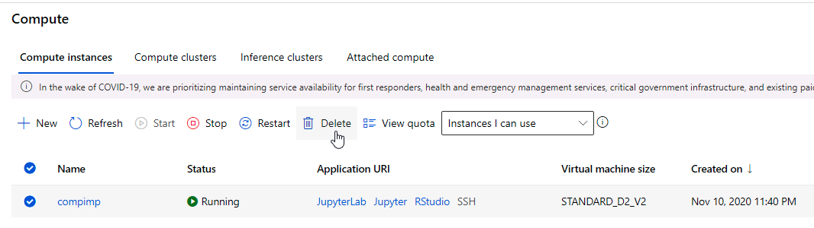

# Optimizing an ML Pipeline in Azure

## Overview

This project is part of the Udacity Azure ML Nanodegree.
In this project, we build and optimize an Azure ML pipeline using the Python SDK and a provided Scikit-learn model.
This model is then compared to an Azure AutoML run.

## Summary

The analyzes dataset contains data about the effectiveness of direct marketing campaigns of a banking institution. A campaign is considered successful when a customer accepts to subscribe to the product offered by the bank. We seek to predict if a client will subscribe or not to the product, an answer that can be seen in the column "y" of the provided dataset.

The best performing model to solve this problem was the Logistic Regression from SKLearn that had hyperparameters chosen by HyperDrive. It reached an accuracy of 91.63%. In contrast, the best accuracy reached by AutoML run was reached by a Voting Ensemble model and had a value of 91.58%, which was very close to the best performing model.

## Scikit-learn Pipeline

To solve this problem, a pipeline architecture was created using a notebook in the Microsoft Azure ML Platform. The idea is to use HyperDrive to tune the hyperparameters of a Logistic Regression model and compare its accuracy with many other models from different algorithms using AutoML.

The first step of the pipeline architecture is to create a CPU cluster based on template setting "STANDARD_D2_V2", which is a general-purpose cluster. This cluster is used to run all experiments in this project.

The second step of the pipeline is to perform a HyperDrive run. This run relies on a few things:

. A SKLean estimator, which is a python script that performs the steps of data cleaning and model training. This script uses a Linear Regression model from SKLearn library to fit the training data. There are two hyperparameters that can be passed to the script using a command-line tool, which is the inverse of regularization strength ("C"), and the maximum number of iterations to converge ("max_iter");
. A parameter sampler specified by the user. In this case, we have used Random Parameter Sampling. This is an interesting sampler because it creates many runs based using random choices for the specified parameters using customized probabilistic distributions. I've opted to select parameter "C" from a uniform distribution between 0.001 and 1.0, and to select the "max_iter" parameter between three values: 100, 1000, and 10000;
. A policy to terminate the jobs in the cluster. In this case, I've selected the Bandit Policy, which is based on slack criteria, and a frequency and delay interval for evaluation. If the primary metric (accuracy) is outside the top 10% range of values calculated so far, Azure ML terminates the job and prevents a potential waste of resources;
. A HyperDrive configuration object using all items described before and stating the primary metric that the run intends to optimize ("Accuracy"), how to do it (maximization), and the max number of runs to be sent to the cluster.

With the correct configuration in place, the run can be dispatched. It took about 36 minutes to run 100 different combinations of parameters and this led to the optimal model, which performed 91.63% accuracy.

The final step of the Scikit-learn pipeline was to save the best model in AzureML so that we can allow it to be deployed in production in the future.

## AutoML

The AutoML run to solve the same problem has performed similarly to the best model generated by HyperDrive in terms of accuracy. A "Voting Ensemble" model was the optimal choice in this case.

The interesting aspect is that this model is easily explainable using the "Explanations" tab. It is possible to see that the feature that has the most impact on the result is the duration of the call. This is intuitively correct. The second feature that impacts the most is the employment variation rate, which is a quarterly indicator. This also seems quite intuitive because more people are employed, the more they are likely to pay for bank service.

## Pipeline comparison

The best performing model to solve this problem was the Logistic Regression from SKLearn that had hyperparameters chosen by HyperDrive. It reached an accuracy of 91.63%. In contrast, the best accuracy reached by AutoML run was reached by a Voting Ensemble model and had a value of 91.58%, which was very close to the best performing model.

Although none of the runs was really difficult to put in place, HyperDrive pipeline is highly customizable, and consequently more complex. The configuration of parameter sampling and a termination policy can be tricky. More steps are necessary for the final step, and only a single algorithm is tested.

AutoML was fairly more simple to configure than HyperDrive. The pipeline has fewer steps. With minimal configuration, dozens of different algorithms and hyperparameters were tested.

Both runs algorithms performed similarly, which was a surprise. I expected AutoML to perform better. However, the runtime and the resources provided were low and probably AutoML would have figured out a better algorithm and hyperparameters with more time.

## Future work

For AutoML, it is possible to increase the timeout and try different numbers of cross-validations. Some algorithms that had less than 90% accuracy could also be excluded from the attempts. In addition to that, the tool pointed during AutoML analysis that "y" column is unbalanced because it has much more data classified as "0" than "1". That last item needs further exploration in the data since it can induce bias in model classification.

For the HyperDrive run, different settings of parameter sampling could be chosen. Termination policy can also be more flexible.

For both experiments, selecting different primary metrics to be optimized could lead to better models.

One more analysis that can be done is to review the wrong classified data and understand which features are influencing the wrong classifications. It is possible to do some feature engineering to create new features and enhance the data cleaning step. 

## Proof of cluster clean up

At the end of the experiment, the cluster must be deleted to avoid unnecessary costs:

